<!-- BACK NAV -->

<a href="../aplicaciones.qmd" style="color: #5EEAD4; font-size: 0.82rem; font-weight: 600; text-decoration: none; display: inline-flex; align-items: center; gap: 0.4rem; opacity: 0.85; transition: opacity 0.2s;"
  onmouseover="this.style.opacity='1'" onmouseout="this.style.opacity='0.85'">
  ← Portafolio de aplicaciones
</a>

<!-- HEADER -->

Infraestructura comunitaria
Placemaking

<h1 style="color: white; font-size: clamp(1.6rem, 4vw, 2.2rem); margin-bottom: 0.4rem; letter-spacing: -0.03em; font-weight: 800;">Teatro Talita Cumi</h1>
<h2 style="color: #CBD5E1; font-size: 1.05rem; font-weight: 400; margin-bottom: 0.5rem;">Sueños que Transforman — Fundación Grupo Argos</h2>

Barrio Manrique · Medellín · Ciclo 2024–2025 · Centro Valor Público EAFIT

SROI Reportado

0.52×

3 años · base

SROI Central

2.35×

3 años · corregido

SROI a 5 años

3.37×

vida útil infraestructura

<!-- STATS STRIP -->

  

    

      $203M
      COP invertidos
    

    

      25
      años deterioro revertidos
    

    

      60
      beneficiarios (central)
    

    

      P38
      percentil global — ciclo 1
    

    

      383
      reportes SVI comparados
    

  

<!-- CONTEXTO -->

Contexto del programa
<h2 class="section-heading">Un espacio que una comunidad esperó 25 años</h2>

<em>Sueños que Transforman</em> (SQT) es una iniciativa de Fundación Grupo Argos que financia mejoras de infraestructura en espacios comunitarios preexistentes en barrios populares de Medellín. En este caso: el Teatro Talita Cumi, en el barrio Manrique, un espacio centenario de la Corporación Minuto de Dios que estuvo en deterioro durante 25 años sin que la comunidad lograra recuperarlo.

La intervención incluyó adecuación física del teatro (iluminación, sonido, camerinos, accesibilidad), fortalecimiento de capacidades de 20 líderes comunitarios y articulación estratégica con Fundación Grupo Argos. El acompañamiento metodológico fue realizado por el Centro Valor Público de EAFIT siguiendo la metodología SROI de Social Value International.

Inversión total

$203M COP

Valor de obra — denominador SROI

Muestra encuestada

20 líderes

Proceso formativo intensivo

Proxy WTP mediana

$6.2M COP

por beneficiario / año

Outcomes identificados

5 impactos

3 monetizados este ciclo

Horizonte analizado

3 años

Vida útil: 15–20 años

  
▶

  

    
Presentación ejecutiva disponible

    
15 diapositivas para junta directiva, inversionistas y aliados — versión RevealJS

  

  <a href="../../02_Aplicaciones/2026_Argos_STC/04_outputs/presentacion_sroi.html" class="pres-cta">Ver presentación →</a>

<!-- DASHBOARD -->

Indicadores clave
<h2 class="section-heading">Panel de resultados del programa</h2>

Los datos primarios revelan cambios sustanciales en múltiples dimensiones. El cuadro de mando sintetiza los resultados más relevantes de la evaluación pareada pre-post (N = 20 líderes comunitarios).

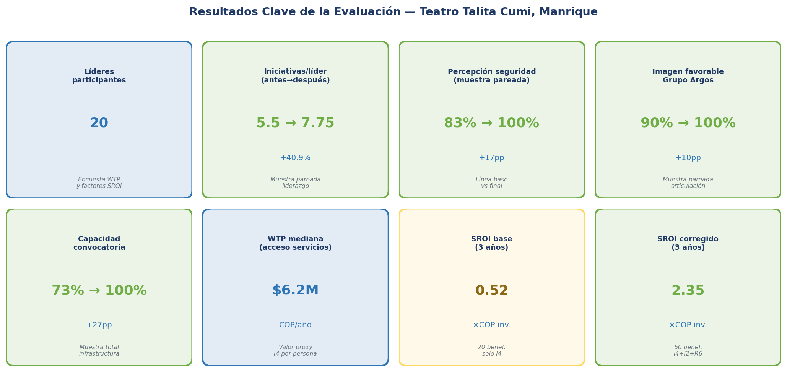

Fuente: Diagnóstico técnico SROI — Teatro Talita Cumi. CVP EAFIT, marzo 2026. N = 20 líderes. Datos pareados pre-post.

<!-- DIAGNÓSTICO TÉCNICO -->

Diagnóstico técnico
<h2 class="section-heading">Por qué 0.52 no refleja el valor total generado</h2>

El SROI reportado (0.52 a 3 años en el escenario base) es metodológicamente correcto en su mecánica de cálculo — los factores de ajuste fueron bien aplicados. El problema no está en los números, sino en las decisiones de alcance. El diagnóstico identifica tres drivers de subestimación, cada uno independiente y acumulable:

Verificación del cálculo original

Fórmula SVI: <code>BN = BB × (1 – DW) × (1 – attr_otros) × (1 – displacement)</code>. Con los datos reportados: <code>$124.9M × 0.533 × 0.738 × 0.902 = $44.3M COP</code>. SROI año 1 = 44.3M / 203M = <strong>0.218</strong>. Verificado y correcto. <em>attr_otros</em> = 26.3% significa que el 73.7% del beneficio se atribuye a SQT — razonable dado que SQT fue el agente físico de la transformación.

Sev.

Driver de subestimación

Efecto SROI

A

Solo 20 beneficiarios vs. comunidad real

El estudio encuestó a los 20 líderes del proceso formativo intensivo. El Teatro atiende además a grupos de danza (Pilositas y Pioneros, 20 años de actividad), equipos deportivos, cursos de barbería/cocina/inglés, adultos mayores y jóvenes en prevención de riesgo. Escalar conservadoramente a 60 beneficiarios equivalentes triplica el beneficio bruto sin cambiar ningún otro supuesto.

×2 a ×5

A

Deadweight de 47% elevado para infraestructura con 25 años de intento fallido

El DW empírico captura la percepción de cambio personal de los líderes. Pero el proxy I4 monetiza el acceso a servicios en una infraestructura que SQT rehabilitó físicamente. Evidencia clave: el teatro estuvo deteriorado 25 años sin recuperación posible. Para infraestructura históricamente no realizada, el DW apropiado es 15–25%. La corrección de DW=47% a DW=25% incrementa el SROI un 40%.

×1.3 a 1.7

A

Solo I4 monetizado de 5 impactos con evidencia cuantitativa

I2 (liderazgo) tiene evidencia pareada sólida: iniciativas por líder +40.9% (5.5 a 7.75). R6 (seguridad) tiene dato pareado: percepción 83% a 100% (+17pp). Ambos tienen proxies documentados y son materiales según el estándar SVI. Con 20 beneficiarios el incremento es modesto; se amplifica al escalar beneficiarios.

+0.05 a 0.20

<!-- METODOLOGÍA -->

Metodología
<h2 class="section-heading">Cómo medimos: las 6 etapas del SROI</h2>

El análisis sigue la metodología <strong>SROI de Social Value International (SVI)</strong>, el estándar global para la medición de valor social. La metodología se articula en seis etapas secuenciales que garantizan rigor, transparencia y reproducibilidad.

  

    
Etapa 1

    
Alcance y stakeholders

    
Definición del perímetro del análisis y los grupos afectados. Para SQT: Fundación Argos (pagador), 20 líderes encuestados, comunidad amplia del teatro (usuarios de danza, deporte, formación), y territorio del barrio Manrique.

  

  

    
Etapa 2

    
Mapa de impacto

    
Construcción participativa de la Teoría del Cambio. $203M COP + metodología CVP EAFIT → recuperación del teatro → 5 tipos de cambio medibles: infraestructura (I4), liderazgo (I2), seguridad (R6), bienestar (I1), economía local (I3).

  

  

    
Etapa 3

    
Evidencia de los outcomes

    
Encuesta pre-post a 20 líderes comunitarios, grupos focales y registro administrativo. Datos pareados para I2 (+41% iniciativas), R6 (+17pp percepción seguridad) e I4 (WTP directa).

  

  

    
Etapa 4

    
Establecer el valor

    
Proxies generados directamente por los beneficiarios: WTP mediana para infraestructura ($6.24M COP/persona/año), costo de diplomado equivalente para liderazgo, costo social evitado para seguridad.

  

  

    
Etapa 5

    
Calcular el impacto neto

    
Aplicación de cuatro factores de ajuste: deadweight (25%), atribución a otros (26.25%), desplazamiento (0%), decaimiento (5% anual). VPN a 3 años / inversión = SROI central 2.35.

  

  

    
Etapa 6

    
Reportar, verificar y actuar

    
Informe completo con supuestos declarados, revisión por pares CVP EAFIT. Verificación formal SVI proyectada para 2027. Este caso documenta el ciclo 1 y la hoja de ruta hacia el aseguramiento.

  

Proxies y factores de ajuste
<h3 style="font-size: 1.15rem; font-weight: 700; color: #0F172A; margin-bottom: 0.5rem; margin-top: 0.25rem;">¿Cómo se valoró cada impacto y cómo se redujo el beneficio bruto?</h3>

  

    
WTP — Encuesta directa

    
Infraestructura accesible (I4)

    
Disposición a pagar por servicios equivalentes en otro espacio de la ciudad. Se usó la <strong>mediana</strong> para proteger el resultado de valores extremos.

    
Mediana: $6.245.400 COP/persona/año · N = 20 líderes

  

  

    
Costo del servicio equivalente

    
Liderazgo comunitario (I2)

    
El incremento en iniciativas activas por líder (+41%) se valoró usando el costo de un diplomado de liderazgo comunitario equivalente en el mercado local.

    
Proxy: $1.500.000 COP/liderazgo-iniciativa · Incremento: 2,25 por líder

  

  

    
Costo evitado

    
Seguridad y prevención (R6)

    
Mejora en percepción de seguridad (+17 pp) aproximada mediante el costo social evitado de la inseguridad (Cruz Guzmán, 2019 — costos prevención crimen Medellín).

    
Proxy: $650.000 COP/pp-mejora/persona · Cambio: de 83% a 100%

  

  

    
Factor

¿Qué ajusta?

Valor aplicado

  

  

    
Peso muerto (DW)

    
Lo que habría ocurrido sin el programa. Corregido de 47% empírico a 25%: el teatro llevaba 25 años sin recuperación posible — evidencia histórica irrefutable.

    
25%

  

  

    
Atribución a otros

    
Parte del beneficio atribuible a otros actores (comunidad, Corporación Minuto de Dios, políticas municipales). SQT retiene el 73.75% como agente físico de la transformación.

    
26.25%

  

  

    
Desplazamiento

    
El Teatro Talita Cumi no compite con ningún otro espacio comunitario existente en Manrique. Desplazamiento estimado en cero.

    
0%

  

  

    
Decaimiento

    
Tasa de reducción anual del impacto. Infraestructura física: lenta degradación. Liderazgo: puede decaer si no hay activación continua. Estimación conservadora.

    
5% anual

  

  

    
Tasa de descuento

    
Costo de oportunidad del dinero en el tiempo. Referencia del Banco de la República para Colombia.

    
7% anual

  

<!-- RESULTADOS -->

Resultados
<h2 class="section-heading">El valor social generado</h2>

  

    
Escenario conservador

    
1.59

    
3 años · 40 beneficiarios infraestructura + liderazgo

  

  

    
Escenario central

    
2.35

    
3 años · 60 beneficiarios infraestructura + liderazgo + seguridad

  

  

    
Central a 5 años

    
3.37

    
Reconociendo la vida útil de la infraestructura (15–20 años)

  

Los tres escenarios superan el umbral de break-even (SROI = 1,0) — en cualquier supuesto plausible, el programa generó más valor social del que costó. La diferencia entre escenarios no refleja incertidumbre sobre si el impacto existe, sino sobre cuántos beneficiarios del espacio se capturan en la medición.

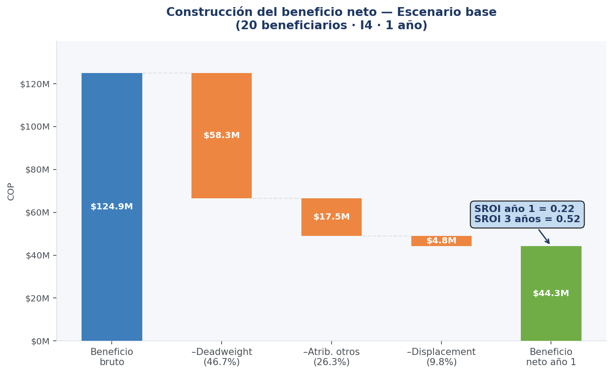

De la inversión al valor social neto. Los tres descuentos (DW 25%, atribución 26.25%, desplazamiento 0%) garantizan que el resultado no sobreatribuye el impacto.

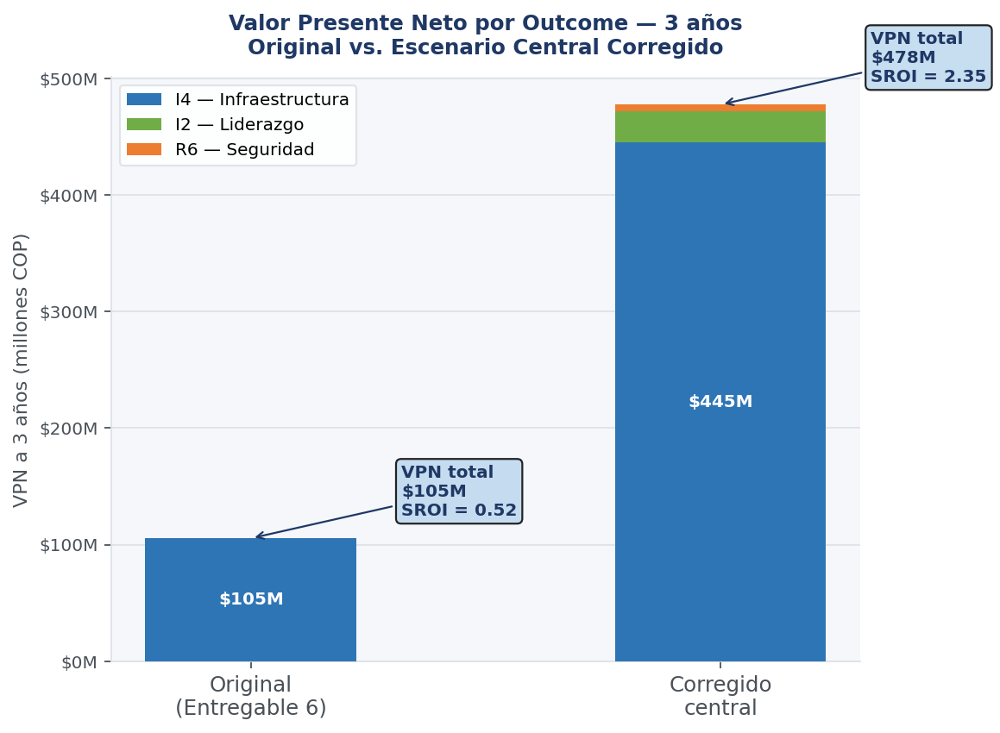

Infraestructura (I4) representa el 83% del valor bruto. Liderazgo (14%) y seguridad (3%) ampliarán su peso al escalar la base de beneficiarios.

<!-- ESCENARIOS -->

Escenarios
<h2 class="section-heading">El espacio completo de resultados plausibles</h2>

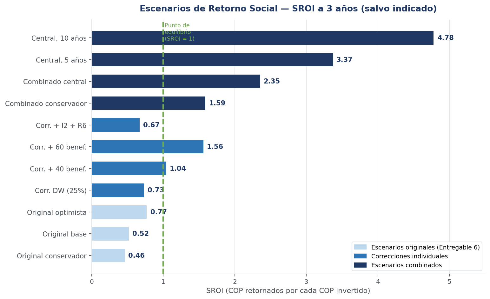

11 escenarios SROI. Línea verde = punto de equilibrio (SROI = 1).

Tabla de escenarios — SROI a 3 años

<table style="margin: 0;">
<thead><tr><th>Escenario</th><th>DW</th><th>Benef.</th><th>Outcomes</th><th>1 año</th><th>3 años</th></tr></thead>
<tbody>
<tr style="background: #FEF3C7;"><td><strong>Original base</strong></td><td>46.7%</td><td>20</td><td>I4</td><td>0.22</td><td><strong>0.52</strong></td></tr>
<tr><td>Corr. DW (25%)</td><td>25.0%</td><td>20</td><td>I4</td><td>0.31</td><td>0.73</td></tr>
<tr><td>Corr. 60 beneficiarios</td><td>46.7%</td><td>60</td><td>I4</td><td>0.65</td><td>1.56</td></tr>
<tr><td>Combinado conservador</td><td>25.0%</td><td>40</td><td>I4+I2</td><td>0.66</td><td>1.59</td></tr>
<tr style="background: #DCFCE7;"><td><strong>Combinado central</strong></td><td>25.0%</td><td>60</td><td>I4+I2+R6</td><td>0.99</td><td><strong>2.35</strong></td></tr>
<tr><td>Central, 5 años</td><td>25.0%</td><td>60</td><td>I4+I2+R6</td><td>—</td><td>3.37</td></tr>
<tr><td>Optimista</td><td>15.0%</td><td>100</td><td>I4+I2+R6</td><td>2.06</td><td>4.91</td></tr>
</tbody>
</table>

<!-- SENSIBILIDAD -->

Análisis de riesgo
<h2 class="section-heading">¿El resultado es robusto?</h2>

El mapa de calor y el gráfico tornado muestran que el resultado es sólido ante variaciones en los parámetros técnicos. El número de beneficiarios es el driver dominante — el único factor verdaderamente addressable para el próximo ciclo.

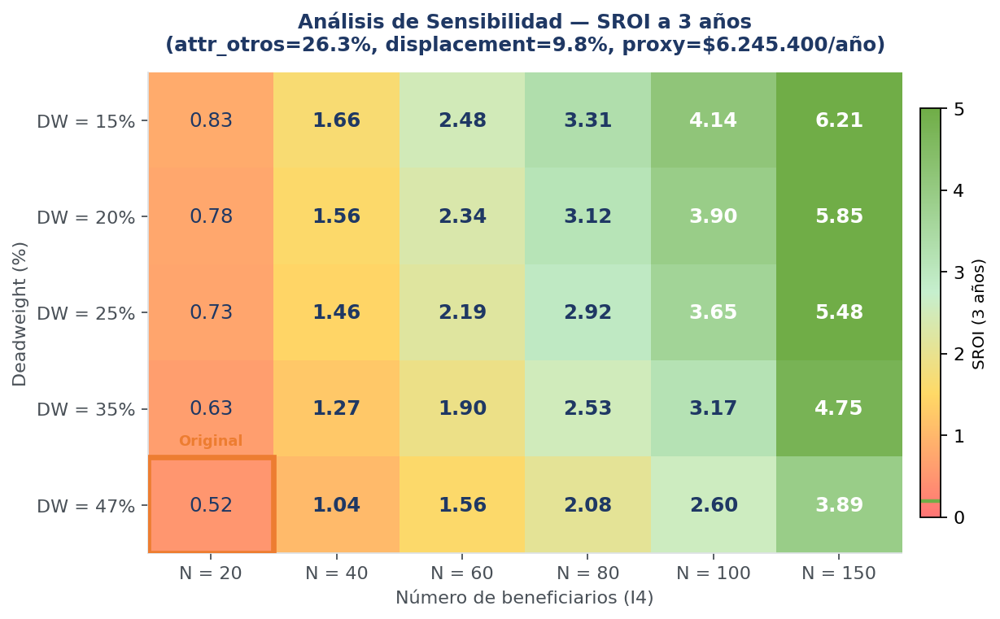

SROI a 3 años para cada combinación de DW y número de beneficiarios. El resultado supera el break-even en prácticamente toda la superficie del mapa.

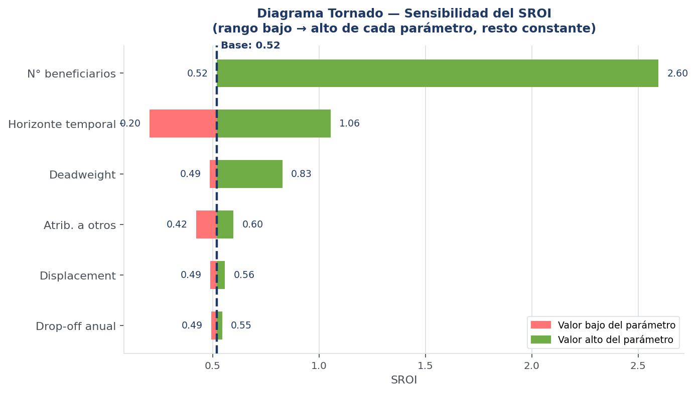

Impacto individual de cada variable sobre el SROI. El número de beneficiarios domina — los parámetros financieros son secundarios.

<!-- VPN ACUMULADO -->

Proyección temporal
<h2 class="section-heading">VPN acumulado a 10 años</h2>

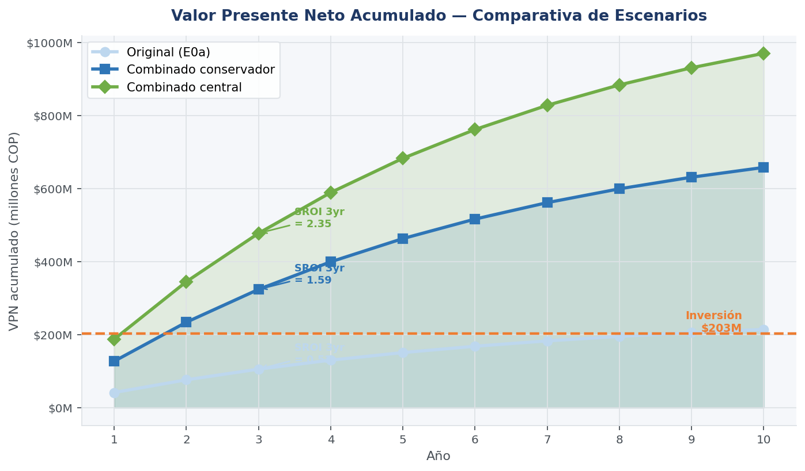

La inversión de $203M se recupera socialmente antes del año 2 en el escenario central. La infraestructura continúa generando valor durante toda su vida útil estimada (15–20 años).

<!-- BENCHMARKING (dark) -->

Comparativa internacional
<h2 class="section-heading">SQT en el contexto global</h2>

Este análisis compara los resultados de SQT con <strong>383 reportes SROI</strong> de la base de datos internacional de Social Value UK, de los cuales 64 reportan un ratio numérico verificable. Los programas de infraestructura comunitaria, placemaking y desarrollo social tienen ratios entre 1,5 y 8,4.

  

    383
    reportes SVI
    base de datos global
  

  

    4.35
    mediana global
    referencia internacional
  

  

    P38
    percentil SQT hoy
    primer ciclo evaluativo
  

  

    P50+
    percentil proyectado
    con contador + encuesta ampliada
  

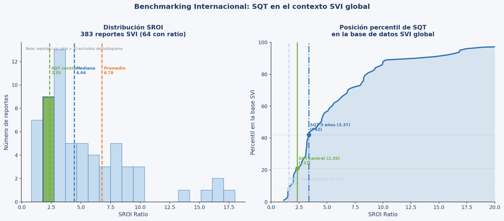

Posición de SQT en la distribución global de 64 ratios verificados. Izquierda: el escenario central (2,35) se ubica en el tercio inferior — resultado esperado para un primer ciclo. Derecha: curva percentil — conservador en P22, central en P38, a 5 años en P50.

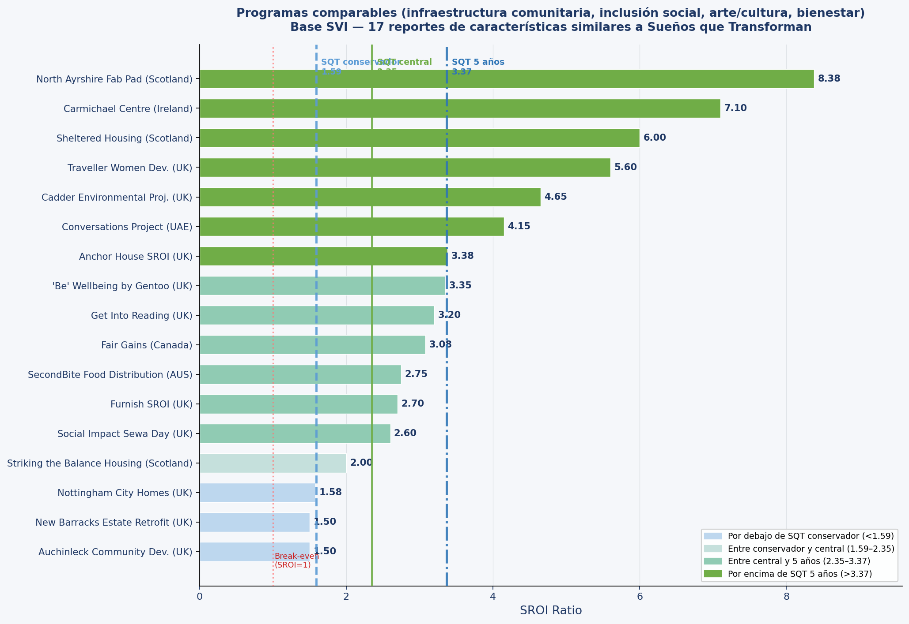

SQT en relación a los 17 programas más comparables de la base SVI. North Ayrshire Fab Pad (8,38) y Carmichael Centre (7,10) representan el potencial del programa con datos más completos — mismo tipo de intervención, misma lógica de impacto.

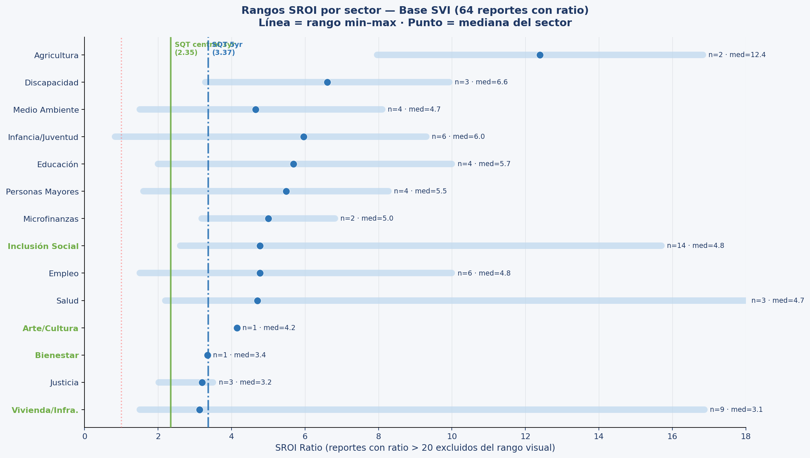

Rangos SROI por sector (punto = mediana). Vivienda/infraestructura: mediana 3,1. Inclusión social: mediana 4,8. La brecha con la mediana sectorial se explica completamente por la captura parcial de beneficiarios del ciclo 1.

  
Lo que dicen los comparables internacionales

  
Ningún programa de espacio comunitario o placemaking comparable tiene SROI bajo cuando usa correctamente su universo de beneficiarios. SQT tiene el mismo tipo de intervención y la misma lógica de impacto que los programas en el percentil 70–80. La diferencia hoy es exclusivamente de datos, no de impacto real.

<!-- HOJA DE RUTA -->

Mejora continua
<h2 class="section-heading">Hoja de ruta hacia el aseguramiento SVI</h2>

El primer ciclo confirma que el programa genera valor social robusto. La siguiente etapa es profundizar la medición para capturar con mayor precisión un impacto que ya existe pero que los datos actuales solo capturan parcialmente.

  

    
Fase 1 · Inmediato

    
Documentar y publicar

    <ul>
      <li>Documentar formalmente el outlier WTP</li>
      <li>Cuantificar inversión total (obra + acompañamiento EAFIT)</li>
      <li>Incluir liderazgo (I2) en el Value Map publicado</li>
      <li>Justificar la codificación de la atribución</li>
    </ul>
  

  

    
Fase 2 · 3–6 meses

    
Ampliar la base de datos

    <ul>
      <li>Instalar contador de acceso mensual al teatro</li>
      <li>Encuesta ampliada a 60–80 usuarios (no solo líderes)</li>
      <li>Registro de emprendimientos y ferias activos</li>
    </ul>
  

  

    
Fase 3 · Próximo ciclo 2026

    
Habilitar nuevos outcomes

    <ul>
      <li>Escala Cantril (0–10) para medir bienestar subjetivo</li>
      <li>Seguimiento de iniciativas de liderazgo a 2 años</li>
      <li>Datos económicos de emprendimientos del espacio</li>
    </ul>
  

  

    
Fase 4 · Ciclo 2027

    
Aseguramiento SVI

    <ul>
      <li>Verificación formal por Social Value International</li>
      <li>Publicación en la base de datos global SVI</li>
      <li>SROI proyectado: 4,5–6,0 con datos completos</li>
    </ul>
  

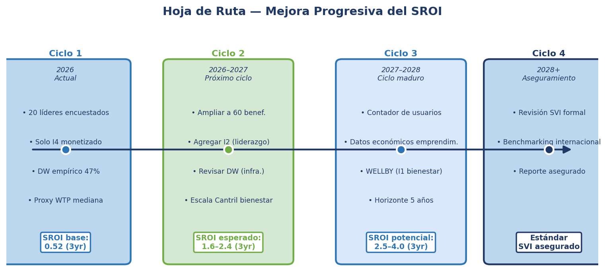

El mayor salto en precisión ocurre en la Fase 2 — la instalación de un contador de acceso y una encuesta ampliada resolverán la principal limitación del ciclo actual.

Recomendaciones inmediatas — Ciclo 2 (2026–2027)

1. <strong>Ampliar base de beneficiarios</strong> con registro de usuarios del espacio. 2. <strong>Revisar el deadweight</strong> separando "cambio personal" de "acceso a infraestructura" — son outcomes distintos. 3. <strong>Agregar I2 (liderazgo)</strong> al Value Map oficial. 4. <strong>Implementar escala Cantril</strong> para habilitar el outcome de bienestar (WELLBY) en el ciclo 3.

<!-- PRINCIPIOS SVI -->

Principios SVI
<h2 class="section-heading">Cumplimiento de los 8 Principios de Social Value International</h2>

Seis principios están completamente aplicados en este ciclo; dos están en proceso para el próximo.

  

    1
    
Involucrar a los stakeholders

    
✓ Proceso pre-post con líderes y grupos focales

  

  

    2
    
Entender lo que cambia

    
✓ Teoría de Cambio con 5 impactos documentados

  

  

    3
    
Valorar lo que importa

    
⚠ I4+I2+R6 monetizados. Bienestar (I1): próximo ciclo

  

  

    4
    
Solo incluir lo material

    
✓ I5 excluido por baja confianza metodológica

  

  

    5
    
No sobreatribuir

    
✓ DW, atribución y desplazamiento aplicados

  

  

    6
    
Ser transparente

    
✓ Supuestos declarados, outlier documentado, rangos reportados

  

  

    7
    
Verificar el resultado

    
⚠ Revisión por pares EAFIT. Aseguramiento SVI: Fase 4 (2027)

  

  

    8
    
Ser responsivo

    
✓ Hoja de ruta con compromisos concretos por fase

  

<!-- PREGUNTAS DIFÍCILES -->

Preguntas difíciles
<h2 class="section-heading">Las críticas más sólidas — y nuestras respuestas</h2>

Un análisis SROI riguroso no evita las preguntas incómodas — las confronta. Esta sección presenta las críticas más fundamentadas de la literatura académica, junto con las respuestas específicas para este análisis.

  
Por qué incluir esta sección

  
La credibilidad de un análisis SROI se construye no solo presentando resultados favorables, sino demostrando que el equipo evaluador conoce las limitaciones del método y ha tomado decisiones conscientes para mitigarlas.

  

    
1

    

      
¿El proxy monetario realmente captura el valor del impacto?

      
Reducir bienestar humano a un número monetario distorsiona su naturaleza. La "disposición a pagar" mide preferencias de consumo, no el valor real del espacio para la comunidad.

    

  

  
Respuesta del análisis

  
<strong>El proxy fue generado directamente por los beneficiarios del programa</strong>, no transferido de otro contexto. Los usuarios del Teatro Talita Cumi indicaron cuánto estarían dispuestos a pagar para acceder a servicios equivalentes en otros espacios. Se usó la <strong>mediana</strong> para proteger el resultado de valores extremos. El bienestar comunitario, la identidad territorial y la dignidad están documentados como outcomes no monetizados de alto valor potencial.

  

    
2

    

      
¿El "peso muerto" del 47% no es simplemente una opinión de los beneficiarios?

      
El contrafactual — qué hubiera pasado sin el programa — es el supuesto más determinante y el menos verificable. Los beneficiarios tienen incentivos para subestimarlo.

    

  

  
Respuesta del análisis

  
<strong>Esta es la crítica más sólida, y la aceptamos parcialmente.</strong> Por eso el análisis <strong>no usa el 47% empírico como definitivo</strong>: lo corrige a 25% basado en evidencia histórica irrefutable — el Teatro llevaba 25 años en deterioro sin recuperación posible. El análisis de sensibilidad muestra el SROI para todos los valores de DW entre 15% y 50%, y supera el break-even en todos.

  

    
3

    

      
¿Solo se incluyeron los outcomes positivos fáciles de monetizar?

      
Los análisis SROI tienden a incluir los outcomes que el analista puede valorar y excluir los difíciles. El resultado puede ser inflado por selección.

    

  

  
Respuesta del análisis

  
<strong>Los tres outcomes incluidos son los que tienen evidencia cuantitativa directa</strong>, no los que maximizan el ratio. Bienestar (I1) y economía local (I3) — que tendrían mayor valor — fueron <strong>excluidos conscientemente</strong> por no tener datos suficientemente sólidos. No se identificó displacement material — el espacio recuperado no compite con ningún otro espacio comunitario en el barrio.

  

    
4

    

      
¿Este SROI se puede comparar con el de otros programas?

      
Dos análisis del mismo tipo de programa pueden arrojar ratios completamente distintos dependiendo de los proxies elegidos, la tasa de descuento y el horizonte temporal. El ratio no tiene unidad de medida estable.

    

  

  
Respuesta del análisis

  
<strong>Esta crítica es metodológicamente correcta y la asumimos explícitamente.</strong> Los benchmarks no pretenden demostrar que SQT es "más eficiente" — pretenden contextualizar el resultado en el rango esperado para este tipo de intervención. Los 17 programas comparables fueron seleccionados por similitud, y la comparación se hace con rangos, no con rankings. Por eso se presentan tres escenarios en lugar de un único número.

  

    
5

    

      
¿Solo participaron 20 personas en el proceso de evaluación?

      
El Principio 1 de SVI exige involucrar a los stakeholders — pero la muestra de 20 líderes puede ser insuficiente para representar a la comunidad real del teatro.

    

  

  
Respuesta del análisis

  
<strong>Es la limitación central de este ciclo evaluativo, y la reconocemos sin reservas.</strong> Los 20 líderes son los más comprometidos e informados — no son representativos del universo de usuarios. La hoja de ruta pone como Prioridad 1 la instalación de un contador de acceso y la ampliación de la encuesta a 60–80 usuarios de distintos perfiles. Los escenarios del análisis ya incorporan esta incertidumbre.

  

    
6

    

      
¿El SROI va a cambiar alguna decisión, o es solo un informe para el financiador?

      
En la práctica, muchos análisis SROI se comisionan para satisfacer requerimientos de financiadores, no para informar decisiones reales de gestión.

    

  

  
Respuesta del análisis

  
<strong>Respondemos con compromisos concretos.</strong> Tres decisiones específicas que cambian: (1) se instalará un contador de acceso antes del próximo ciclo; (2) el outcome de liderazgo (I2) se incorpora al Value Map oficial desde este ciclo; (3) el deadweight se revisará de forma diferenciada por tipo de outcome (físico vs. organizacional). El próximo informe incluirá una sección explícita de "¿Qué cambió en el programa a partir de esta evaluación?"

<!-- CONCLUSIONES (dark) -->

Conclusiones
<h2 class="section-heading">El valor está ahí — el camino para demostrarlo también</h2>

<strong style="color: white;">Sueños que Transforman generó valor social real y robusto.</strong> El análisis establece con confianza que por cada peso invertido se generaron entre $1,59 y $2,35 en valor social — y $3,37 a cinco años. El resultado es sólido cuantitativamente (supera el break-even en todos los escenarios), comparativamente (P22–P50 global) y metodológicamente (todos los factores de ajuste fueron obtenidos empíricamente).

La única barrera entre el resultado actual (P38) y el rango mediano de programas comparables (P50–P65) es la captura incompleta de beneficiarios — una limitación de datos, no de impacto real.

  

    
Hoy — ciclo 1

    
2.35

    
P38 global · 20 líderes encuestados

  

  

    
Con contador + encuesta ampliada

    
~3.5

    
P50–55 estimado · 80+ beneficiarios

  

  

    
Con bienestar WELLBY (I1)

    
~5.0

    
P65 estimado · escala Cantril

  

<blockquote style="border-left: 3px solid #0D9488; background: rgba(13,148,136,0.1); border-radius: 0 0.625rem 0.625rem 0; padding: 1rem 1.5rem; margin: 2rem 0; font-style: italic; color: #E2E8F0; font-size: 1.03rem;">
  "El Teatro Talita Cumi dejó de ser un espacio físico recuperado para convertirse en un territorio de posibilidades. Hoy, 25 años después de que la comunidad empezó a soñar, SQT hizo posible lo que parecía imposible."
  <cite style="display: block; font-size: 0.82rem; color: #94A3B8; margin-top: 0.5rem; font-style: normal; font-weight: 600;">— Participante del proceso evaluativo, línea final 2025</cite>
</blockquote>

<!-- FOOTER -->

Centro Valor Público · Universidad EAFIT · Medellín, Colombia

Confidencial — Fundación Grupo Argos · Marzo 2026

