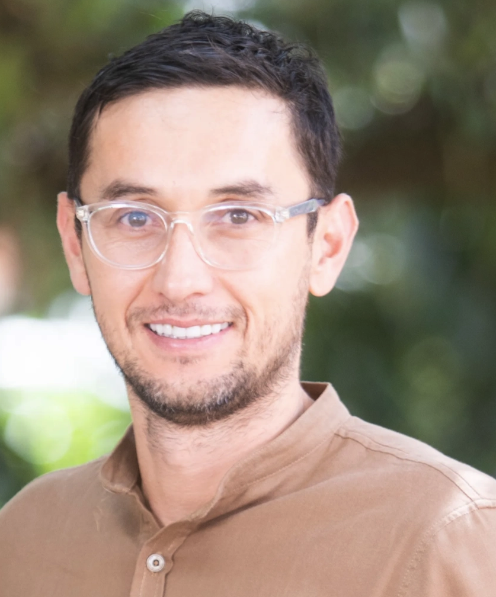
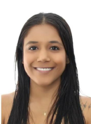
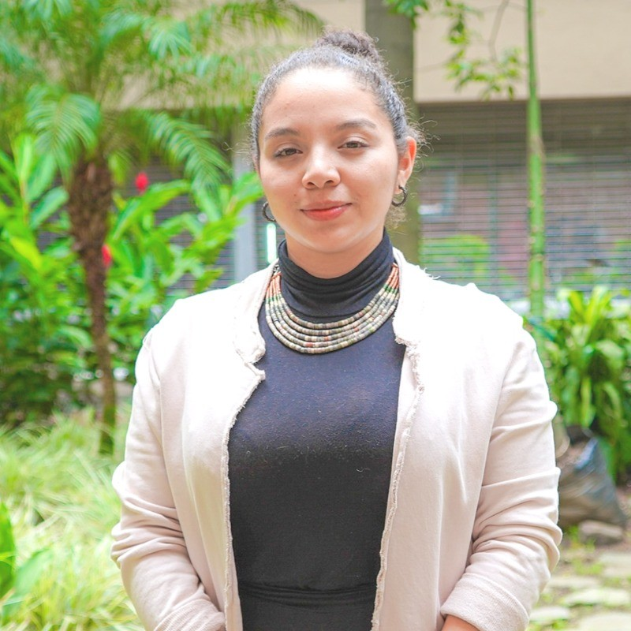
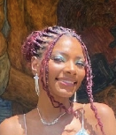

```{=html}
<div class="page-header eq-header">
  <div class="page-header-content">
    <div class="page-badge">Centro Valor Publico &middot; EAFIT</div>
    <h1 class="page-title">Nuestro equipo</h1>
    <p class="page-subtitle">
      Cinco profesionales que combinan investigacion academica de frontera,
      experiencia en evaluacion de impacto social y dominio de inteligencia artificial.
      No es un equipo nuevo — es el equipo que ya lo hizo.
    </p>
  </div>
</div>

<!-- EQUIPO INTRO -->
<div class="content-section">
<div class="content-inner">

<p style="font-size:0.95rem;color:#475569;line-height:1.75;max-width:780px;">
  El equipo CVP integra cinco frentes funcionales: liderazgo estrategico y certificacion SVI,
  coordinacion y evaluacion cuantitativa, investigacion cualitativa y relacionamiento comunitario,
  analitica de datos e inferencia causal, y desarrollo de IA y plataformas digitales.
  Varios de sus miembros han trabajado juntos en los mismos clientes — no hay curva de
  aprendizaje entre ellos.
</p>

<!-- CREDENCIALES COLECTIVAS -->
<div class="eq-creds-strip">
  <div class="eq-cred"><span class="eq-cred-num">16+</span><span class="eq-cred-label">Articulos en revistas indexadas<br>(Nature, eLife, World Development)</span></div>
  <div class="eq-cred"><span class="eq-cred-num">7</span><span class="eq-cred-label">Contratos SMEL ejecutados<br>como equipo</span></div>
  <div class="eq-cred"><span class="eq-cred-num">COP 2.1B+</span><span class="eq-cred-label">En proyectos de medicion<br>de impacto social</span></div>
  <div class="eq-cred"><span class="eq-cred-num">1ro</span><span class="eq-cred-label">Certificacion SVI activa<br>en Colombia</span></div>
</div>

</div>
</div>

<!-- ============================================================
     PERFILES
     ============================================================ -->
<div class="content-section alt">
<div class="content-inner">

<!-- JC -->
<div class="eq-profile eq-profile--lead">
  <div class="eq-photo-wrap">
    
    <div class="eq-photo-badge eq-badge--teal">Director</div>
  </div>
  <div class="eq-profile-body">
    <div class="eq-name">Juan Carlos Munoz Mora, Ph.D.</div>
    <div class="eq-role">Director del proyecto e Investigador Principal</div>
    <div class="eq-affil">Centro de Valor Publico &middot; Universidad EAFIT &middot; <strong>Certificado Social Value International (SVI)</strong></div>
    <p class="eq-bio">
      Liderazgo estrategico en valoracion de impacto social. Diseño metodologico de Teorias del Cambio
      y analisis SROI bajo los 7 Principios SVI con ruta a <em>Report Assurance</em>. IP de 7 contratos SMEL
      en 4 años — Comfama, Swiss Philanthropy, Argos, BID, AGROSAVIA, Grupo Argos, Despacio.
      Unico profesional en Colombia con certificacion activa de Social Value International habilitada
      para el proceso de aseguramiento externo de informes SROI.
    </p>
    <div class="eq-tags-row">
      <span class="eq-tag eq-tag--teal">SROI &amp; SVI</span>
      <span class="eq-tag eq-tag--teal">Teoria del Cambio</span>
      <span class="eq-tag eq-tag--teal">Report Assurance</span>
      <span class="eq-tag eq-tag--teal">Liderazgo estrategico</span>
    </div>
    <div class="eq-portfolio">
      <div class="eq-port-label">Portafolio como IP</div>
      <div class="eq-port-items">
        <span>Comfama &middot; Regiones</span>
        <span>Swiss Philanthropy &middot; iMEL</span>
        <span>Argos &middot; Hogares Saludables</span>
        <span>BID &middot; Fondo Colombia Sostenible</span>
        <span>AGROSAVIA &middot; ToC institucional</span>
        <span>Grupo Argos &middot; Uraba</span>
      </div>
    </div>
  </div>
</div>

<div class="eq-divider"></div>

<!-- DANIELA -->
<div class="eq-profile">
  <div class="eq-photo-wrap">
    
    <div class="eq-photo-badge eq-badge--blue">Coordinadora</div>
  </div>
  <div class="eq-profile-body">
    <div class="eq-name">Daniela Mejia Tejada, MSc</div>
    <div class="eq-role">Coordinadora del Proyecto &mdash; Evaluacion de Impacto y Analisis de Datos</div>
    <div class="eq-affil">Centro de Valor Publico &middot; Universidad EAFIT</div>
    <p class="eq-bio">
      MSc Economia (EAFIT) con especializacion en Cultura de Paz y DIH (PUJ). Coordinadora operativa
      de los analisis SROI y sistemas de monitoreo. Ha participado en 5 de los 8 proyectos del portafolio
      CVP — incluyendo Comfama, Argos, BID y Grupo Argos. 8 articulos en revistas indexadas
      (Nature, Frontiers, World Development) en evaluacion de impacto de vivienda, cadenas de valor
      agricola y desigualdad historica en Colombia.
    </p>
    <div class="eq-tags-row">
      <span class="eq-tag eq-tag--blue">Evaluacion de impacto</span>
      <span class="eq-tag eq-tag--blue">Analisis de datos</span>
      <span class="eq-tag eq-tag--blue">Power BI</span>
      <span class="eq-tag eq-tag--blue">SROI cuantitativo</span>
    </div>
    <div class="eq-portfolio">
      <div class="eq-port-label">Proyectos compartidos con clientes clave</div>
      <div class="eq-port-items">
        <span>AGROSAVIA &middot; SMEL y ToC</span>
        <span>Argos &middot; Hogares Saludables</span>
        <span>BID &middot; Mejoramiento de vivienda</span>
        <span>Proantioquia-Comfama &middot; Bono PPR</span>
        <span>Grupo Argos &middot; Uraba</span>
      </div>
    </div>
  </div>
</div>

<div class="eq-divider"></div>

<!-- PAOLA -->
<div class="eq-profile">
  <div class="eq-photo-wrap">
    
    <div class="eq-photo-badge eq-badge--purple">Cualitativa</div>
  </div>
  <div class="eq-profile-body">
    <div class="eq-name">Paola Velasquez Quintero, MSc</div>
    <div class="eq-role">Experta Cualitativa &mdash; Evaluacion Participativa y Aprendizaje</div>
    <div class="eq-affil">Centro de Valor Publico &middot; Universidad EAFIT &middot; Tesis <em>Cum Laude</em></div>
    <p class="eq-bio">
      MSc Salud Mental <em>Cum Laude</em> (UdeA, 2024). Seis anos liderando investigacion participativa
      con comunidades vulnerables: NNA victimas de explotacion sexual, jovenes egresados del sistema
      de proteccion, comunidades indigenas NASA. Evaluaciones con USAID (Parque Explora) y CLACSO.
      Garantiza que los procesos cualitativos sean co-construccion — no extraccion de datos.
    </p>
    <div class="eq-tags-row">
      <span class="eq-tag eq-tag--purple">Investigacion participativa</span>
      <span class="eq-tag eq-tag--purple">Grupos focales</span>
      <span class="eq-tag eq-tag--purple">Salud publica</span>
      <span class="eq-tag eq-tag--purple">Sistematizacion</span>
    </div>
    <div class="eq-portfolio">
      <div class="eq-port-label">Evaluaciones destacadas</div>
      <div class="eq-port-items">
        <span>Parque Explora / USAID &middot; Clubes y Retos Explora</span>
        <span>UdeA &middot; Buen Vivir Juvenil (NASA)</span>
        <span>UdeA &middot; NNA en sistema de proteccion</span>
        <span>Mesa Intersectorial &middot; 40+ organizaciones</span>
      </div>
    </div>
  </div>
</div>

<div class="eq-divider"></div>

<!-- LAURA -->
<div class="eq-profile">
  <div class="eq-photo-wrap">
    
    <div class="eq-photo-badge eq-badge--amber">Analitica</div>
  </div>
  <div class="eq-profile-body">
    <div class="eq-name">Laura Pena Agualimpia</div>
    <div class="eq-role">Analista de Datos &mdash; Inferencia Causal y Evaluacion Cuantitativa</div>
    <div class="eq-affil">Economista &middot; Universidad de Antioquia &middot; Matricula de Honor</div>
    <p class="eq-bio">
      Matricula de Honor — mejor promedio de su cohorte en Economia (UdeA). Asistente de investigacion
      en el Banco de la Republica (Grupo GAMLA): procesamiento de la GEIH, modelos de inferencia causal
      (Difference-in-Differences, Event Study) y NLP con OCR. Working paper en progreso sobre efectos
      de la IA en el mercado laboral colombiano. Stack tecnico completo: Stata, R, Python, SQL, Power BI.
    </p>
    <div class="eq-tags-row">
      <span class="eq-tag eq-tag--amber">Inferencia causal</span>
      <span class="eq-tag eq-tag--amber">Python &middot; R &middot; Stata</span>
      <span class="eq-tag eq-tag--amber">Power BI</span>
      <span class="eq-tag eq-tag--amber">Evaluacion contrafactual</span>
    </div>
    <div class="eq-portfolio">
      <div class="eq-port-label">Experiencia clave</div>
      <div class="eq-port-items">
        <span>Banco de la Republica &middot; GAMLA</span>
        <span>DiD y Event Study en mercado laboral</span>
        <span>NLP + OCR automatizado</span>
        <span>Analisis GEIH a escala nacional</span>
      </div>
    </div>
  </div>
</div>

<div class="eq-divider"></div>

<!-- SEBAS -->
<div class="eq-profile">
  <div class="eq-photo-wrap">
    
    <div class="eq-photo-badge eq-badge--indigo">IA &amp; Tech</div>
  </div>
  <div class="eq-profile-body">
    <div class="eq-name">Sebastian Vasquez Lopez, Ph.D. (Oxon)</div>
    <div class="eq-role">Desarrollador Tecnologico &mdash; Inteligencia Artificial y Plataformas Digitales</div>
    <div class="eq-affil">Cofundador, Two Sigma Lab &middot; Ex-investigador, University of Oxford</div>
    <p class="eq-bio">
      Ph.D. Neurociencia (Oxford, 2017). Diez anos en IA aplicada, machine learning y ciencia de datos.
      Faculty AI Fellowship (Londres, 2025). Becario Clarendon (Oxford) y Colfuturo. Cofundo Two Sigma Lab,
      ecosistema de investigacion impulsado por IA. Publicaciones en <em>Nature Light</em> y <em>eLife</em>.
      Es el arquitecto natural de sistemas agenticos que convierten datos en inteligencia organizacional.
    </p>
    <div class="eq-tags-row">
      <span class="eq-tag eq-tag--indigo">Sistemas agenticos</span>
      <span class="eq-tag eq-tag--indigo">LLMs &middot; LangChain</span>
      <span class="eq-tag eq-tag--indigo">Python &middot; Docker</span>
      <span class="eq-tag eq-tag--indigo">Oxford &middot; Faculty AI</span>
    </div>
    <div class="eq-portfolio">
      <div class="eq-port-label">Experiencia clave</div>
      <div class="eq-port-items">
        <span>University of Oxford &middot; Postdoc IA</span>
        <span>Faculty AI &middot; Fellowship Londres 2025</span>
        <span>Two Sigma Lab &middot; Cofundador</span>
        <span>UK Ministry of Education &middot; LLMs educacion</span>
        <span>Unity Technologies &middot; Software engineer</span>
      </div>
    </div>
  </div>
</div>

</div>
</div>

<!-- TABLA RESUMEN -->
<div class="content-section">
<div class="content-inner">

<span class="section-label">Resumen del equipo</span>
<h2 class="section-heading">Cinco frentes, una sola estrategia</h2>

<div class="eq-table-wrap">
<table class="eq-table">
  <thead>
    <tr>
      <th>Nombre</th>
      <th>Rol</th>
      <th>Formacion</th>
      <th>Diferenciador clave</th>
    </tr>
  </thead>
  <tbody>
    <tr>
      <td><strong>Juan Carlos Munoz Mora</strong></td>
      <td><span class="eq-role-pill" style="background:#F0FDFA;color:#0D9488;border-color:#CCFBF1;">Director &middot; IP</span></td>
      <td>Ph.D. &middot; Cert. SVI</td>
      <td>Unico profesional en Colombia con certificacion SVI activa para <em>Report Assurance</em></td>
    </tr>
    <tr>
      <td><strong>Daniela Mejia Tejada</strong></td>
      <td><span class="eq-role-pill" style="background:#EFF6FF;color:#1D4ED8;border-color:#BFDBFE;">Coordinadora</span></td>
      <td>MSc Economia EAFIT</td>
      <td>5 proyectos CVP ejecutados &middot; 8 publicaciones indexadas en evaluacion de impacto</td>
    </tr>
    <tr>
      <td><strong>Paola Velasquez Quintero</strong></td>
      <td><span class="eq-role-pill" style="background:#F5F3FF;color:#7C3AED;border-color:#DDD6FE;">Cualitativa</span></td>
      <td>MSc Salud Mental <em>Cum Laude</em></td>
      <td>6 anos en investigacion participativa con comunidades vulnerables &middot; USAID</td>
    </tr>
    <tr>
      <td><strong>Laura Pena Agualimpia</strong></td>
      <td><span class="eq-role-pill" style="background:#FFFBEB;color:#D97706;border-color:#FDE68A;">Analitica</span></td>
      <td>Economista UdeA &middot; Matricula de Honor</td>
      <td>Banco de la Republica &middot; DiD &middot; Event Study &middot; NLP</td>
    </tr>
    <tr>
      <td><strong>Sebastian Vasquez Lopez</strong></td>
      <td><span class="eq-role-pill" style="background:#EEF2FF;color:#4338CA;border-color:#C7D2FE;">IA &amp; Tech</span></td>
      <td>Ph.D. Oxford &middot; Faculty AI</td>
      <td>10+ anos en IA aplicada &middot; Sistemas agenticos &middot; Two Sigma Lab</td>
    </tr>
  </tbody>
</table>
</div>

</div>
</div>

<!-- CTA -->
<div class="content-section dark">
<div class="content-inner" style="display:flex;justify-content:space-between;align-items:center;flex-wrap:wrap;gap:1rem;padding:1rem 0;">
<div>
<div style="color:#94A3B8;font-size:0.85rem;margin-bottom:0.35rem;">Listo para empezar</div>
<div style="font-size:1.1rem;font-weight:700;color:white;">Hablemos de su proyecto de valoracion de impacto</div>
</div>
<a href="herramientas.html" class="btn-primary-custom">Ver nuestros servicios &rarr;</a>
</div>
</div>
```

```{=html}
<style>
/* HEADER */
.eq-header {
  background: linear-gradient(135deg, #0F172A 0%, #1E293B 40%, #1E3A5F 75%, #1D4ED8 100%);
}

/* CREDENCIALES STRIP */
.eq-creds-strip {
  display: grid;
  grid-template-columns: repeat(4, 1fr);
  gap: 1rem;
  margin: 1.75rem 0 0;
  padding: 1.5rem;
  background: #0F172A;
  border-radius: 1rem;
}
.eq-cred { text-align: center; }
.eq-cred-num {
  display: block;
  font-size: 1.75rem;
  font-weight: 900;
  color: #5EEAD4;
  line-height: 1;
  margin-bottom: 0.4rem;
}
.eq-cred-label {
  font-size: 0.72rem;
  color: #94A3B8;
  font-weight: 500;
  text-transform: uppercase;
  letter-spacing: 0.04em;
  line-height: 1.4;
}

/* PROFILE CARD */
.eq-profile {
  display: flex;
  gap: 2rem;
  align-items: flex-start;
  padding: 1.5rem 0;
}
.eq-profile--lead .eq-photo {
  box-shadow: 0 0 0 3px #0D9488, 0 4px 20px rgba(13,148,136,0.25);
}

.eq-photo-wrap {
  flex-shrink: 0;
  position: relative;
  width: 130px;
}
.eq-photo {
  width: 130px;
  height: 130px;
  border-radius: 1rem;
  object-fit: cover;
  object-position: top center;
  display: block;
}
.eq-photo-badge {
  position: absolute;
  bottom: -8px;
  left: 50%;
  transform: translateX(-50%);
  font-size: 0.62rem;
  font-weight: 800;
  text-transform: uppercase;
  letter-spacing: 0.07em;
  padding: 0.18rem 0.65rem;
  border-radius: 999px;
  white-space: nowrap;
}
.eq-badge--teal   { background: #0D9488; color: white; }
.eq-badge--blue   { background: #1D4ED8; color: white; }
.eq-badge--purple { background: #7C3AED; color: white; }
.eq-badge--amber  { background: #D97706; color: white; }
.eq-badge--indigo { background: #4338CA; color: white; }

/* PROFILE BODY */
.eq-profile-body { flex: 1; }
.eq-name {
  font-size: 1.2rem;
  font-weight: 800;
  color: #0F172A;
  margin-bottom: 0.2rem;
  line-height: 1.2;
}
.eq-role {
  font-size: 0.85rem;
  font-weight: 600;
  color: #0D9488;
  margin-bottom: 0.25rem;
}
.eq-affil {
  font-size: 0.78rem;
  color: #64748B;
  margin-bottom: 0.75rem;
}
.eq-bio {
  font-size: 0.875rem;
  color: #475569;
  line-height: 1.7;
  margin-bottom: 0.85rem;
}
.eq-tags-row {
  display: flex;
  flex-wrap: wrap;
  gap: 0.4rem;
  margin-bottom: 0.85rem;
}
.eq-tag {
  font-size: 0.68rem;
  font-weight: 700;
  padding: 0.15rem 0.6rem;
  border-radius: 999px;
  border: 1px solid;
}
.eq-tag--teal   { background: #F0FDFA; color: #0D9488; border-color: #CCFBF1; }
.eq-tag--blue   { background: #EFF6FF; color: #1D4ED8; border-color: #BFDBFE; }
.eq-tag--purple { background: #F5F3FF; color: #7C3AED; border-color: #DDD6FE; }
.eq-tag--amber  { background: #FFFBEB; color: #D97706; border-color: #FDE68A; }
.eq-tag--indigo { background: #EEF2FF; color: #4338CA; border-color: #C7D2FE; }

/* PORTFOLIO */
.eq-portfolio {
  background: #F8FAFC;
  border: 1px solid #E2E8F0;
  border-radius: 0.65rem;
  padding: 0.85rem 1rem;
}
.eq-port-label {
  font-size: 0.7rem;
  font-weight: 700;
  color: #94A3B8;
  text-transform: uppercase;
  letter-spacing: 0.07em;
  margin-bottom: 0.5rem;
}
.eq-port-items {
  display: flex;
  flex-wrap: wrap;
  gap: 0.4rem;
}
.eq-port-items span {
  font-size: 0.75rem;
  color: #334155;
  background: white;
  border: 1px solid #E2E8F0;
  padding: 0.15rem 0.6rem;
  border-radius: 0.35rem;
}

/* DIVIDER */
.eq-divider {
  height: 1px;
  background: #E2E8F0;
  margin: 0.5rem 0;
}

/* TABLE */
.eq-table-wrap {
  overflow-x: auto;
  border-radius: 0.75rem;
  border: 1px solid #E2E8F0;
  box-shadow: 0 1px 4px rgba(0,0,0,0.05);
  margin: 1.25rem 0;
}
.eq-table {
  width: 100%;
  border-collapse: collapse;
  font-size: 0.865rem;
}
.eq-table thead tr { background: #0F172A; color: #F8FAFC; }
.eq-table thead th {
  padding: 0.85rem 1rem;
  font-weight: 600;
  font-size: 0.78rem;
  letter-spacing: 0.04em;
  text-transform: uppercase;
  border: none;
  text-align: left;
}
.eq-table tbody tr { border-bottom: 1px solid #F1F5F9; transition: background 0.15s; }
.eq-table tbody tr:hover { background: #F8FAFC; }
.eq-table tbody tr:last-child { border-bottom: none; }
.eq-table tbody td { padding: 0.75rem 1rem; color: #334155; vertical-align: middle; }
.eq-role-pill {
  display: inline-block;
  font-size: 0.72rem;
  font-weight: 700;
  padding: 0.15rem 0.6rem;
  border-radius: 999px;
  border: 1px solid;
  white-space: nowrap;
}

/* RESPONSIVE */
@media (max-width: 700px) {
  .eq-profile { flex-direction: column; align-items: center; text-align: center; }
  .eq-tags-row { justify-content: center; }
  .eq-port-items { justify-content: center; }
  .eq-creds-strip { grid-template-columns: repeat(2, 1fr); }
}
</style>
```
